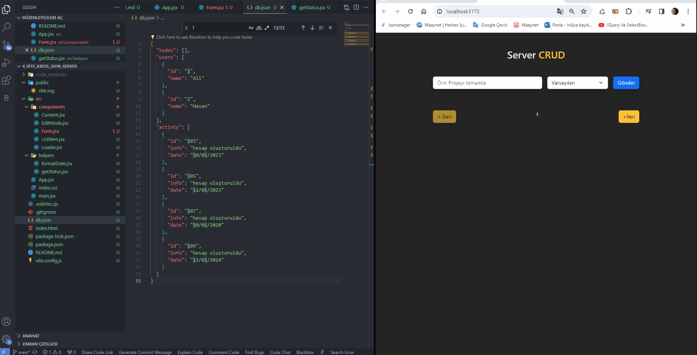

<h2>Server_Crud</h2>

Uygulama bir not alma uygulamasıdır, uygulama üzerinden not eklenebilir, eklenen not düzenlenebilir ve silinebilir.

<h2>Kullanılan Teknolojiler </h2>
React, Axios,Json Server ve Boostrap kütüphanesi kullanılmıştır.

<h2>Nasıl Kullanabilirim?</h2>

1. projeyi klonlayın

- git clone https://github.com/hulyabayik2145/server_crud.git

2. Proje klasörüne gidin

- cd 'klasörünüz'

3. Localdeki Server i başlatmak için

- npm run server

4. projeyi başlatmak için

- npm run dev

<h3>Ekran Gif</h3>

